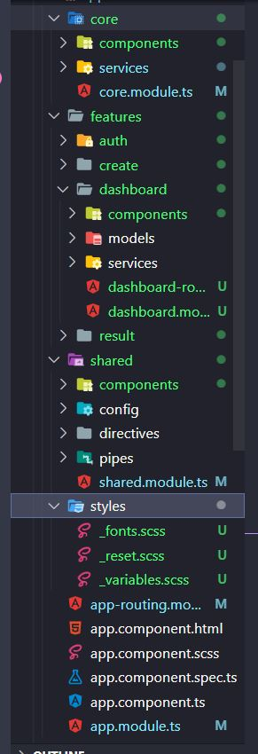

# Project: Anonymous Poll

This project was generated with [Angular CLI](https://github.com/angular/angular-cli) version 14.1.0.

## Development server

Run `ng serve` for a dev server. Navigate to `http://localhost:4200/`. The application will automatically reload if you change any of the source files.

## Code scaffolding

Run `ng generate component component-name` to generate a new component. You can also use `ng generate directive|pipe|service|class|guard|interface|enum|module`.

## Build

Run `ng build` to build the project. The build artifacts will be stored in the `dist/` directory.

## Running unit tests

Run `ng test` to execute the unit tests via [Karma](https://karma-runner.github.io).

## Running end-to-end tests

Run `ng e2e` to execute the end-to-end tests via a platform of your choice. To use this command, you need to first add a package that implements end-to-end testing capabilities.

## Further help

To get more help on the Angular CLI use `ng help` or go check out the [Angular CLI Overview and Command Reference](https://angular.io/cli) page.

# Project Description

To create a project, we chose:

```
ng new mini-poll-frontend
```

_<Angular@14.1.0 & Typesript@4.7.2 versions>_

## Structure

We build the project working with multiple modules.

**Each feature is a module**.
Inside each feature modules, we have:

- The components folder that includes all components of the feature.
- The services folder that includes feature's services or interceptors
- The models folder that includes all models/interfaces of data.

Besides, there is an additional module `core` that includes some elements used once in the Angular app such as header, spinner, services... and the `shared` module for storing commonly used components, directives, pipes, config, directives.

The initial project structure below:

```

```
